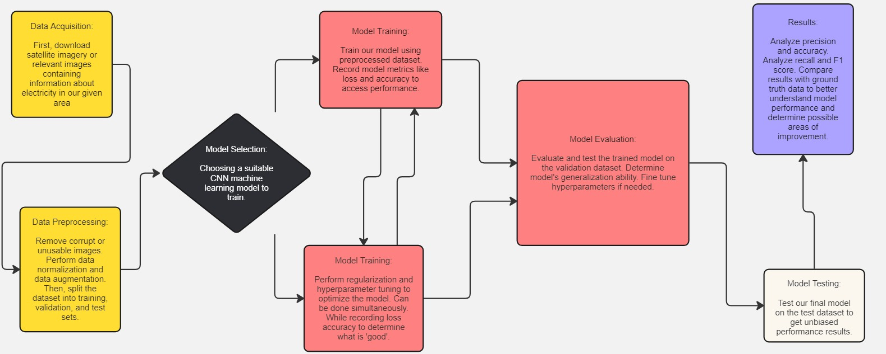
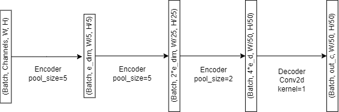
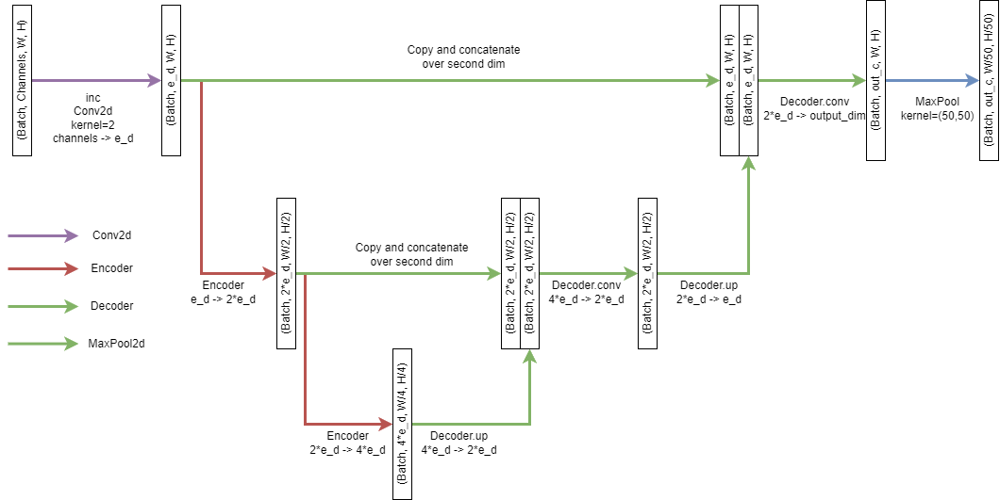

# FINAL PROJECT READ ME

### Mr. Brightside
Maxwell Huang, Danny Nguyen, Bryant Phan, Zoya Hajee  
  
  
  
  
  

## Project Overview
In this project we created a baseline deep learning model for semantic segmentation. What did this repository do?
  - [X] Built a CNN segmentation model from scratch.
  - [X] Use the pre-trained FCNResnet101 to transfer learn the segmentation task on remote sensing data.
  - [X] Built a UNet segmentation model to experiment with skip connection networks.
- [X] Used PyTorch Lightning to simplify and decouple training and validation loops. 
- [X] Monitored model training using Weights and Biases
- [X] Performed hyperparameter sweeps to select best model hyperparameters.
- [X] Adapt the code to reconstruct ground truth, and prediction subtiles to visually compare.
- [X] Perform validation to evaluate segmentation task performance using, Jaccard Index, Intersection over Union, Accuracy, AUC: Area under the Receiver Operator Curve (ROC), and F1-score.

## Getting Started
To make sure you download all the packages to begin we will utilize a Python virtual environment.

1. Navigate to the desired directory to store the project.

2. Clone the repository and change directory

   `git clone https://github.com/cs175cv-w2024/final-project-mr-brightside.git`

   `cd ./final-project-mr-brightside`
4. Create a virtual environment:
   
   `python3 -m venv esdenv`
5. Activate the virtual environment:
   * On macOS and Linux:
  
        `source esdenv/bin/activate`
   * On Windows:
  
        `.\esdenv\Scripts\activate`
6. Install the required packages:
    `pip install -r requirements.txt`

To deactivate the virtual environment, type `deactivate`.

# Modeling
### Model Pipeline

### The PyTorch `nn.Module`
Creating a model in pytorch is based on the `torch.nn.Module` class. Each of these modules represent part of a neural network and are meant to be reusable and composable components that can easily be arranged to create different architectures. In order to compose these, we inherit from a `Module` or include a `Module` inside another `Module`'s class variables, so the outer `Module` registers all the inner `Module`'s parameters as its own, letting us perform gradient descent without needing to explicitly calculate the derivative. We must inherit from the PyTorch nn.Module to define your model. The constructor allows use to define the layer architecture comprising of convolutional, pooling, and fully connected layers. The forward method chains the layers together with activation functions retrieved from PyTorch's torch.nn.functional library.

### PyTorch Lightning Module
To remove the overhead of boilerplate code that often pollutes the main functions of many a naive machine learning researcher, PyTorch Lightning provides an organized way of approaching the training and validation loop. By inheriting from pl.LightningModule, we created a class that calls the model defined using nn.Module with additional Accuracy metrics in the __init__. We implemented member functions __init__, forward, training_step, validation_step, and configure_optimziers.

If you need more information on how to use PyTorch Lightning with PyTorch as well as helpful tutorials, you can look at:
- [PyTorch Lightning: Basic Skills](https://lightning.ai/docs/pytorch/latest/levels/core_skills.html)
- [A Recipe for Training Neural Networks](http://karpathy.github.io/2019/04/25/recipe/)

### Segmentation CNN
This model represents a single feedforward CNN which works as a funnel to lower the resolution down to our segmentation's resolution. Each encoder does 2 convolutions, followed by a `MaxPool2d` operation which reduces the resolution of the image, at the same time, each encoder will increase the number of channels by 2, starting from `embedding_size`. This encoder is used 3 times, the first one lowers the resolution from WxH to W/5xH/5, the second one to W/25xH/25 and the third one to W/50xH/50. For example, if you are using a 200x200 subtile size, this will result in a prediction mask of size 4x4, which should correspond to the size of the image. A final decoder then takes the resulting channels and uses a 1x1 convolution to lower them down to the number of classes, creating logits for each class.

### Transfer Resnet101
This model tries to leverage a pretrained model used for another task. While the task is completely different, many layers in the neural network are similar between related tasks, meaning that the gradient descent process is easier since most layers are pre-trained with similar solutions. Both tasks, however, use different kinds of images, requiring you to replace some layers to make them compatible. Namely, the first layer in an FCNResnet101 is meant to be used for RGB images, meaning that you will need to change this layer to allow for the number of satellite channels. This can easily be done in PyTorch though, by simply assigning the layer with a new layer, for example, `model.backbone.conv1 = nn.Conv2d(...)` will replace the layer with a new one of your choice. The other layer that needs to be changed is the last one, `model.classifier`, which needs to be changed so that the number of channels matches the number of prediction classes.

Finally, an `AvgPool2d` layer must be added at the end, this is because FCNResnet is meant to be used in segmentation problems where the resolution of the images is the same as the resolution of the masks, however, as we don't have that luxury, the next best thing is to average a 50x50 patch in order to get the average prediction of all the pixels.

### U-Net
This model uses what is called a "skip connection", these are inspired by the nonlinear nature of brains, and are generally good at helping models "remember" informatiion that might have been lost as the network gets longer. These are done by saving the partial outputs of the networks, known as residuals, and appending them later to later partial outputs of the network. In our case, we have the output of the `inc` layer, as the first residual, and each layer but the last one as the rest of the residuals. Each residual and current partial output are then fed to the `Decoder` layer, which performs a reverse convolution (`ConvTranspose2d`) on the partial output, concatenates it to the residual and then performs another convolution. At the end, we end up with an output of the same resolution as the input, so we must `MaxPool2d` in order to make it the same resolution as our target mask.

## Training
We will train the models using the model architectures defined above in conjunction with the PyTorch Lightning Module for ease of running the training step in `train.py.` 

### `ESDConfig` Python Dataclass
In `train.py` we have created an `ESDConfig` dataclass to store all the paths and parameters for experimenting with the training step. In the main function we have provided you with code that utilize the library `argparse` which takes command line arguments using custom flags that allow you to overwrite the default configurations defined in the dataclass. 

When running train, for example, if you would like to run training for the architecture `SegmentationCNN` for five epochs you would run:
`python -m scripts.train --model_type=SegmentationCNN --max_epochs=5`
If you want to read more on the argparse, please read: [`argparse`](https://docs.python.org/3/howto/argparse.html).

## Validation
We can run validation using the script `evaluate.py` where we load the model weights from the last checkpoint and make a forward pass through the model in order to generate prediction masks. Similar to `ESDConfig` in `train.py`, `EvalConfig` is the dataclass that sets the default configuration for the validation loop when arguments are not passed via command line. Note the use of `argparse` in the main function and its similarities to the `train.py` file.

### Visualization: Restitching Predictions to Compare with Ground Truth
`evaluate.py` calls functions in `visualization/restitch_plot.py` which adapt the `restitch` function from `src/preprocessing/subtile_esd_hw02.py`
to restitch the predictions and groundtruth back to the original 16x16 dimensions for plotting purposes using the same colormap as defined in the IEEE GRSS ESD 2021 Competition.

### References We Used
- [Overview of Semantic Segmentation](https://www.jeremyjordan.me/semantic-segmentation/)
- [Cook Your First UNET in Pytorch](https://towardsdatascience.com/cook-your-first-u-net-in-pytorch-b3297a844cf3)
- [Tune Hyperparameters](https://docs.wandb.ai/guides/sweeps)
- [Running Hyperparameter Sweeps to Pick the Best Model](https://wandb.ai/wandb_fc/articles/reports/Running-Hyperparameter-Sweeps-to-#)
    
